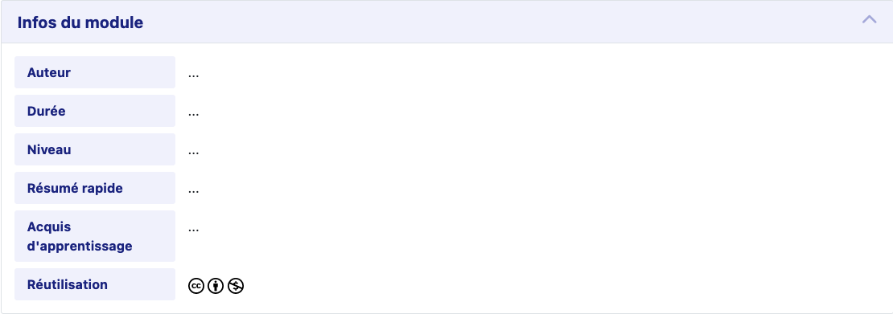

# Course Info Template

Collapsable HTML template to display course informations.



## Usage

Add the `styles.css` CSS to your application.

Copy the HTML structure from `template.html` into your rich editor.

## Customize

### Setup

```
npm install
npm run sass
```

### Development

Modify the `src/styles.sass` file, then compile using the following commands :
- `npm run sass` for dev
- `npm run sass:prod` for production
